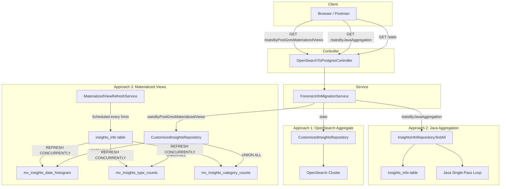

# Materialized Views — What, Why & How They Help

> **Project:** OpenSearch to PostgreSQL Migration  
> **Date:** April 15, 2026

---

## Table of Contents

1. [What Are Materialized Views?](#1-what-are-materialized-views)
2. [Why Do We Need Them?](#2-why-do-we-need-them)
3. [How Materialized Views Work in This Project](#3-how-materialized-views-work-in-this-project)
4. [The Three Aggregation Approaches — Compared](#4-the-three-aggregation-approaches--compared)
   - [statsByOpenSearchAggregate (stats)](#41-statsbyopensearchaggregate-stats)
   - [statsByJavaAggregation](#42-statsbyjavaaggregation)
   - [statsByPostGresMaterializedViews](#43-statsbypostgresmaterializedviews)
5. [Architecture Diagram](#5-architecture-diagram)
6. [Data Flow Comparison](#6-data-flow-comparison)
7. [Performance Comparison](#7-performance-comparison)
8. [When to Use Which Approach](#8-when-to-use-which-approach)
9. [Trade-offs](#9-trade-offs)

---

## 1. What Are Materialized Views?

A **Materialized View** is a database object that stores the **pre-computed result** of a query physically on disk — unlike a regular view, which re-executes the query every time it's accessed.

```
┌──────────────────────────────────────────────────────────────────────────┐
│                        Regular View vs Materialized View                │
├─────────────────────────────────┬────────────────────────────────────────┤
│         Regular View            │         Materialized View              │
├─────────────────────────────────┼────────────────────────────────────────┤
│ Virtual — no data stored        │ Physical — data stored on disk         │
│ Re-executes query every time    │ Returns pre-computed result instantly  │
│ Always up-to-date               │ Stale until refreshed                  │
│ Slow for complex aggregations   │ Fast reads, even for heavy queries     │
│ No indexes allowed              │ Can have indexes for faster lookup     │
└─────────────────────────────────┴────────────────────────────────────────┘
```

### SQL Example

```sql
-- Create a materialized view that pre-computes daily insight counts
CREATE MATERIALIZED VIEW mv_insights_date_histogram AS
SELECT
    to_char(i.original_insight_time, 'YYYY-MM-DD') AS period,
    i.account_id,
    i.forensic_info_id,
    COUNT(i.insight_id) AS count
FROM insights_info i
GROUP BY period, i.account_id, i.forensic_info_id
ORDER BY period;
```

The first time this runs, PostgreSQL executes the `SELECT`, computes all the aggregations, and **stores the result as a table**. Subsequent reads are just table scans on this small, pre-computed table — not the full `insights_info` table.

### Refreshing

Since materialized views are snapshots, they need to be **refreshed** to reflect new data:

```sql
-- Blocking: locks the view during refresh (no reads allowed)
REFRESH MATERIALIZED VIEW mv_insights_date_histogram;

-- Non-blocking: allows reads during refresh (requires a UNIQUE index)
REFRESH MATERIALIZED VIEW CONCURRENTLY mv_insights_date_histogram;
```

---

## 2. Why Do We Need Them?

### The Problem: Aggregation Queries Are Expensive

In this **OpenSearch to PostgreSQL** migration project, the application needs to compute aggregation statistics for forensic investigation insights:

- **Date histogram** — how many insights per day/month
- **Type counts** — how many insights of each type (Abnormal, IoC, Informational)
- **Category counts** — how many insights per category

These aggregations require scanning the entire `insights_info` table (potentially thousands of rows), grouping, counting, and returning results — **on every single API call**.

### The Impact Without Materialized Views

| Operation | What Happens | Cost |
|-----------|-------------|------|
| Every API call to `/stats` | Full table scan of `insights_info` | O(n) — grows with data |
| 3 separate aggregations | 3 full scans of the same table | 3 × O(n) |
| Concurrent users | Each user triggers their own full scans | Multiplied load |
| Growing dataset | Response time degrades linearly | Unbounded |

### The Solution: Pre-Compute Once, Read Many Times

Materialized views flip the model:

```
❌ WITHOUT MVs: Every API request → Full table scan → Aggregate → Return
✅ WITH MVs:    Background job → Full table scan → Store result
                Every API request → Read pre-computed table → Return instantly
```

The expensive computation happens **once** (in the background), and every API request just reads a small, pre-computed table.

---

## 3. How Materialized Views Work in This Project

### 3.1 Three Materialized Views

| Materialized View | Purpose | Source Table |
|-------------------|---------|-------------|
| `mv_insights_date_histogram` | Pre-computed daily insight counts | `insights_info` |
| `mv_insights_type_counts` | Pre-computed counts per insight type | `insights_info` |
| `mv_insights_category_counts` | Pre-computed counts per insight category | `insights_info` |

### 3.2 Background Refresh Service

Instead of refreshing on every API call (which defeats the purpose), the project uses a **scheduled background service**:

```java
// MaterializedViewRefreshService.java
@Scheduled(fixedRate = 300_000) // every 5 minutes
@Transactional
public void refreshAllMaterializedViews() {
    entityManager.createNativeQuery(
        "REFRESH MATERIALIZED VIEW CONCURRENTLY mv_insights_date_histogram"
    ).executeUpdate();
    entityManager.createNativeQuery(
        "REFRESH MATERIALIZED VIEW CONCURRENTLY mv_insights_type_counts"
    ).executeUpdate();
    entityManager.createNativeQuery(
        "REFRESH MATERIALIZED VIEW CONCURRENTLY mv_insights_category_counts"
    ).executeUpdate();
}
```

Key details:
- **`CONCURRENTLY`** — allows reads during refresh (no downtime)
- **Every 5 minutes** — configurable; balances freshness vs. DB load
- **Requires UNIQUE indexes** on each MV for `CONCURRENTLY` to work

### 3.3 Single UNION ALL Query

At query time, all 3 MVs are queried in a **single SQL statement** using `UNION ALL`:

```sql
SELECT 'date_histogram' AS agg_type, period AS key, NULL AS type, NULL AS category, count AS doc_count
FROM mv_insights_date_histogram WHERE ...
UNION ALL
SELECT 'type_counts', NULL, type, NULL, SUM(doc_count)
FROM mv_insights_type_counts WHERE ... GROUP BY ...
UNION ALL
SELECT 'category_counts', NULL, NULL, category, SUM(doc_count)
FROM mv_insights_category_counts WHERE ... GROUP BY ...
```

This means **1 database round-trip** instead of 3 separate queries.

### 3.4 Required Indexes

```sql
-- Enable REFRESH CONCURRENTLY
CREATE UNIQUE INDEX idx_mv_date_hist_pk
    ON mv_insights_date_histogram(period, account_id, forensic_info_id);

CREATE UNIQUE INDEX idx_mv_type_pk
    ON mv_insights_type_counts(account_id, forensic_info_id, type, original_insight_time);

CREATE UNIQUE INDEX idx_mv_category_pk
    ON mv_insights_category_counts(account_id, forensic_info_id, category, original_insight_time);
```

---

## 4. The Three Aggregation Approaches — Compared

This project implements **three different approaches** to compute the same aggregation result. Each serves a different purpose and has different trade-offs.

---

### 4.1 statsByOpenSearchAggregate (`/stats`)

> **API:** `GET /migration/opensearch-to-postgres/stats`  
> **Time:** 16 ms (old) → **14 ms** (new)  
> **Approach:** Delegate aggregation to OpenSearch (the original data source)

#### How It Works

```
Client → Controller → Service → Repository → OpenSearch (native aggregation DSL)
                                                    ↓
                                              OpenSearch computes:
                                              • date_histogram
                                              • type_counts
                                              • category_counts
                                                    ↓
                                              Returns JSON result
                                                    ↓
                                           Map to AggregationRoot POJO
                                                    ↓
                                              Return to client
```

#### What Happens Under the Hood

1. The repository builds an **OpenSearch aggregation query** using OpenSearch's native DSL
2. OpenSearch executes the aggregation **server-side** — no data leaves OpenSearch
3. The result is a pre-structured JSON with buckets, counts, and histograms
4. Java simply maps the JSON to the `AggregationRoot` POJO

#### Key Characteristics

| Aspect | Detail |
|--------|--------|
| **Data Source** | OpenSearch |
| **Aggregation Engine** | OpenSearch (server-side) |
| **PostgreSQL Involved?** | ❌ No |
| **Table Scans** | N/A (OpenSearch handles internally) |
| **DB Round-Trips** | 0 to PostgreSQL, 1 to OpenSearch |
| **Data Freshness** | Real-time (queries live OpenSearch index) |
| **Java Processing** | Minimal — just JSON mapping |

#### When to Use
- When data **still lives in OpenSearch** (pre-migration or hybrid mode)
- When you need **real-time** results from the source of truth
- When OpenSearch cluster is available and responsive

---

### 4.2 statsByJavaAggregation (`/statsByJavaAggregation`)

> **API:** `GET /migration/opensearch-to-postgres/statsByJavaAggregation`  
> **Time:** 19 ms (old) → **19 ms** (new)  
> **Approach:** Fetch raw entities from PostgreSQL, aggregate in Java

#### How It Works

```
Client → Controller → Service → Repository → PostgreSQL
                                                   ↓
                                           SELECT * FROM insights_info
                                           WHERE account_id = ? AND ...
                                                   ↓
                                           Returns List<InsightsInfo> entities
                                                   ↓
                                        Java single-pass aggregation loop:
                                        ┌──────────────────────────────────┐
                                        │  for each InsightsInfo:          │
                                        │    • dateHistogramMap.merge()    │
                                        │    • typeCounts.merge()          │
                                        │    • categoryCounts.merge()      │
                                        └──────────────────────────────────┘
                                                   ↓
                                           Map to AggregationRoot POJO
                                                   ↓
                                             Return to client
```

#### What Happens Under the Hood

1. JPA `Specification` builds a dynamic `WHERE` clause from query parameters
2. `findAll(spec)` loads all matching `InsightsInfo` entities into JVM memory
3. A **single-pass loop** iterates once over the list, computing all 3 aggregations simultaneously:
   - Date histogram (count per day)
   - Type counts (Abnormal, IoC, Informational)
   - Category counts
4. Results are mapped to the `AggregationRoot` POJO

#### Key Characteristics

| Aspect | Detail |
|--------|--------|
| **Data Source** | PostgreSQL (`insights_info` table) |
| **Aggregation Engine** | Java (in-memory, single-pass loop) |
| **PostgreSQL Involved?** | ✅ Yes — fetches raw rows |
| **Table Scans** | No full scan — uses composite indexes |
| **DB Round-Trips** | 2 (1 for time bounds + 1 for entity list) |
| **Data Freshness** | Real-time (queries live table) |
| **Java Processing** | Heavy — loads all entities into heap, iterates |

#### When to Use
- When you need **real-time** results from PostgreSQL
- When the dataset is **small to medium** (entities fit in JVM memory)
- When you want **flexibility** to add custom Java logic to aggregation
- When materialized views are not available or not set up

---

### 4.3 statsByPostGresMaterializedViews (`/statsByPostGresMaterializedViews`)

> **API:** `GET /migration/opensearch-to-postgres/statsByPostGresMaterializedViews`  
> **Time:** 23 ms (old) → **14 ms** (new) — **39.1% improvement**  
> **Approach:** Query pre-computed materialized views in PostgreSQL

#### How It Works

```
                    ┌──────────────────────────────────────────────┐
                    │       Background: @Scheduled (every 5 min)   │
                    │                                              │
                    │  REFRESH MATERIALIZED VIEW CONCURRENTLY      │
                    │    • mv_insights_date_histogram              │
                    │    • mv_insights_type_counts                 │
                    │    • mv_insights_category_counts             │
                    └──────────────────────────────────────────────┘

Client → Controller → Service → Repository → PostgreSQL
                                                   ↓
                                           Single UNION ALL query across
                                           3 pre-computed MVs:
                                           ┌─────────────────────────────┐
                                           │ mv_insights_date_histogram  │
                                           │ mv_insights_type_counts     │
                                           │ mv_insights_category_counts │
                                           └─────────────────────────────┘
                                                   ↓
                                           Returns aggregated rows
                                           (already computed, just filtered)
                                                   ↓
                                           Map to AggregationRoot POJO
                                                   ↓
                                             Return to client
```

#### What Happens Under the Hood

1. Materialized views are **pre-computed** in the background every 5 minutes
2. At query time, a single `UNION ALL` SQL query reads from 3 small MV tables
3. The MVs already contain the aggregated counts — no `GROUP BY` on the raw table
4. The `@Transactional(readOnly = true)` annotation skips Hibernate dirty-checking
5. Results are mapped to the `AggregationRoot` POJO

#### Key Characteristics

| Aspect | Detail |
|--------|--------|
| **Data Source** | PostgreSQL (materialized views) |
| **Aggregation Engine** | PostgreSQL (pre-computed at refresh time) |
| **PostgreSQL Involved?** | ✅ Yes — reads from MVs |
| **Table Scans** | No — reads small pre-computed tables |
| **DB Round-Trips** | 1 (single UNION ALL query) |
| **Data Freshness** | Near real-time (up to 5 min stale) |
| **Java Processing** | Minimal — just result mapping |

#### When to Use
- When **speed is critical** (dashboards, KPI tiles)
- When **slightly stale data is acceptable** (up to 5 min delay)
- When the dataset is **large** (MVs avoid full table scans)
- When the same aggregation is queried **frequently** by multiple users

---

## 5. Architecture Diagram



---

## 6. Data Flow Comparison

```
┌─────────────────────────────────────────────────────────────────────────────────────────┐
│                              DATA FLOW PER API CALL                                     │
├──────────────────────────────┬──────────────────────────────┬────────────────────────────┤
│   statsByOpenSearchAggregate │     statsByJavaAggregation   │ statsByPostGresMVs         │
├──────────────────────────────┼──────────────────────────────┼────────────────────────────┤
│                              │                              │                            │
│  API Request                 │  API Request                 │  API Request               │
│       │                      │       │                      │       │                    │
│       ▼                      │       ▼                      │       ▼                    │
│  OpenSearch DSL query        │  MIN/MAX time bounds query   │  MIN/MAX time bounds query │
│       │                      │       │                      │       │                    │
│       ▼                      │       ▼                      │       ▼                    │
│  OpenSearch computes         │  SELECT * FROM insights_info │  UNION ALL across 3 MVs    │
│  aggregation server-side     │       │                      │  (pre-computed data)       │
│       │                      │       ▼                      │       │                    │
│       ▼                      │  Load N entities into JVM    │       ▼                    │
│  Return JSON result          │       │                      │  Return aggregated rows    │
│       │                      │       ▼                      │       │                    │
│       ▼                      │  Single-pass loop:           │       ▼                    │
│  Map to POJO                 │  compute 3 aggregations      │  Map to POJO              │
│       │                      │       │                      │       │                    │
│       ▼                      │       ▼                      │       ▼                    │
│  Response (14ms)             │  Map to POJO → Response      │  Response (14ms)           │
│                              │  (19ms)                      │                            │
├──────────────────────────────┼──────────────────────────────┼────────────────────────────┤
│  Entities loaded: 0          │  Entities loaded: N          │  Entities loaded: 0        │
│  Table scans: 0              │  Table scans: 0 (indexed)    │  Table scans: 0 (MVs)     │
│  DB round-trips: 0 (PG)     │  DB round-trips: 2           │  DB round-trips: 1         │
│  Java processing: minimal    │  Java processing: heavy      │  Java processing: minimal  │
└──────────────────────────────┴──────────────────────────────┴────────────────────────────┘
```

---

## 7. Performance Comparison

### Response Times

| Endpoint | Old Code | New Code | Improvement |
|----------|:--------:|:--------:|:-----------:|
| statsByOpenSearchAggregate | 16 ms | **14 ms** | 🟢 -2 ms (12.5%) |
| statsByJavaAggregation | 19 ms | **19 ms** | 🟡 0 ms |
| statsByPostGresMaterializedViews | 23 ms | **14 ms** | 🟢 -9 ms (39.1%) |

### Why Materialized Views Improved the Most

The MV approach had the **biggest performance gain** (-9ms, 39.1%) because the old code was:

1. **Refreshing 3 MVs on every API call** — defeating the entire purpose of pre-computation
2. **Running 3 separate SQL queries** — 3 DB round-trips per request
3. **Using a read-write transaction** — unnecessary Hibernate overhead

After optimization:
- Refresh moved to background `@Scheduled` job → **-8–12 ms**
- 3 queries consolidated into 1 `UNION ALL` → **-2–4 ms**
- `@Transactional(readOnly = true)` → marginal improvement

### Visual Comparison

```mermaid
xychart-beta
    title "Response Time — Old vs New (ms)"
    x-axis ["OpenSearch Aggregate", "Java Aggregation", "Postgres MVs"]
    y-axis "Time (ms)" 0 --> 30
    bar "Old" [16, 19, 23]
    bar "New" [14, 19, 14]
```




> **Old times:** OpenSearch Aggregate: 16ms | Java Aggregation: 19ms | Postgres MVs: 23ms
> **New times:** OpenSearch Aggregate: 14ms | Java Aggregation: 19ms | Postgres MVs: 14ms

### Resource Usage Comparison

| Metric | OpenSearch Aggregate | Java Aggregation | Materialized Views |
|--------|:-------------------:|:----------------:|:-----------------:|
| **JVM Heap Usage** | Low | High (loads entities) | Low |
| **PostgreSQL CPU** | None | Medium (query + index scan) | Low (read pre-computed) |
| **OpenSearch CPU** | Medium | None | None |
| **Network I/O** | 1 call to OpenSearch | 2 calls to PostgreSQL | 1 call to PostgreSQL |
| **Scales with data?** | OpenSearch handles it | Degrades (more entities in heap) | Constant (MVs are small) |

---

## 8. When to Use Which Approach

```
┌─────────────────────────────────────────────────────────────────────────┐
│                        DECISION MATRIX                                  │
├───────────────────────┬───────────┬─────────────┬───────────────────────┤
│ Requirement           │ OpenSearch │ Java Agg    │ Materialized Views   │
│                       │ Aggregate │             │                      │
├───────────────────────┼───────────┼─────────────┼───────────────────────┤
│ Real-time data        │ ✅ Best   │ ✅ Yes      │ ⚠️ Up to 5 min stale │
│ Speed (low latency)   │ ✅ 14ms   │ ⚠️ 19ms    │ ✅ 14ms              │
│ Large datasets        │ ✅ Yes    │ ❌ Slow     │ ✅ Yes               │
│ No OpenSearch needed  │ ❌ No     │ ✅ Yes      │ ✅ Yes               │
│ No extra DB objects   │ ✅ Yes    │ ✅ Yes      │ ❌ Needs MVs+indexes │
│ Custom Java logic     │ ❌ No     │ ✅ Yes      │ ❌ No                │
│ Dashboard / KPI tiles │ ✅ Good   │ ⚠️ OK      │ ✅ Best              │
│ Post-migration (no OS)│ ❌ N/A    │ ✅ Yes      │ ✅ Yes               │
└───────────────────────┴───────────┴─────────────┴───────────────────────┘
```

### Recommendations

| Scenario | Recommended Approach | Reason |
|----------|---------------------|--------|
| **Dashboard KPIs & charts** | Materialized Views (14ms) | Speed + PostgreSQL-native, slight staleness is acceptable |
| **Data still in OpenSearch** | OpenSearch Aggregate (14ms) | Query the source directly, no migration overhead |
| **Post-migration (no OpenSearch)** | Materialized Views (14ms) | Fastest PostgreSQL-only approach |
| **Need exact real-time from PostgreSQL** | Java Aggregation (19ms) | Queries live table, no staleness |
| **Small dataset + custom logic** | Java Aggregation (19ms) | Flexible, no DB setup needed |
| **High-concurrency dashboards** | Materialized Views (14ms) | MVs handle concurrent reads without load on source table |

---

## 9. Trade-offs

### Materialized Views — Pros & Cons

| ✅ Pros | ❌ Cons |
|---------|--------|
| Extremely fast reads (pre-computed) | Data can be up to 5 min stale |
| No JVM heap pressure | Requires DB setup (CREATE, indexes) |
| Handles large datasets efficiently | Refresh consumes DB resources |
| Concurrent reads during refresh | Needs UNIQUE indexes for `CONCURRENTLY` |
| 1 DB round-trip (UNION ALL) | Additional storage for MV tables |
| `readOnly` transaction — minimal overhead | Must manage refresh schedule |

### OpenSearch Aggregate — Pros & Cons

| ✅ Pros | ❌ Cons |
|---------|--------|
| Real-time data | Requires OpenSearch infrastructure |
| OpenSearch optimized for aggregations | Not available post-migration |
| No PostgreSQL load | Network dependency on OpenSearch cluster |
| Minimal Java processing | Less control over aggregation logic |

### Java Aggregation — Pros & Cons

| ✅ Pros | ❌ Cons |
|---------|--------|
| Real-time data from PostgreSQL | Loads all entities into JVM heap |
| Full control over aggregation logic | Scales poorly with large datasets |
| No extra DB objects needed | 2 DB round-trips |
| Easy to add custom business logic | Higher Java processing overhead |

---

## Summary

> **Materialized Views** are the optimal approach for this OpenSearch-to-PostgreSQL migration when the primary use case is **dashboard aggregation** (date histograms, type counts, category counts).
>
> They eliminate the need for OpenSearch while matching its performance (**14ms**), at the cost of data being up to **5 minutes stale** — a trade-off that is perfectly acceptable for dashboard visualizations.
>
> For use cases requiring **exact real-time data** from PostgreSQL, **Java Aggregation** (19ms) remains available as a fallback.

---

*Related docs:*
- *[Performance Comparison Report](performance-comparison.md) — Benchmark numbers and screenshots*
- *[Before vs After Performance Fixes](before-vs-after-performance-fixes.md) — Code-level changes and optimizations*

