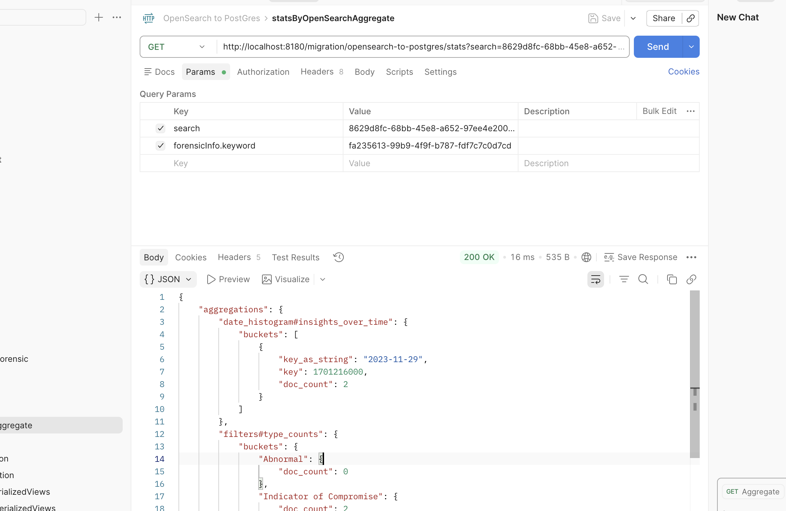
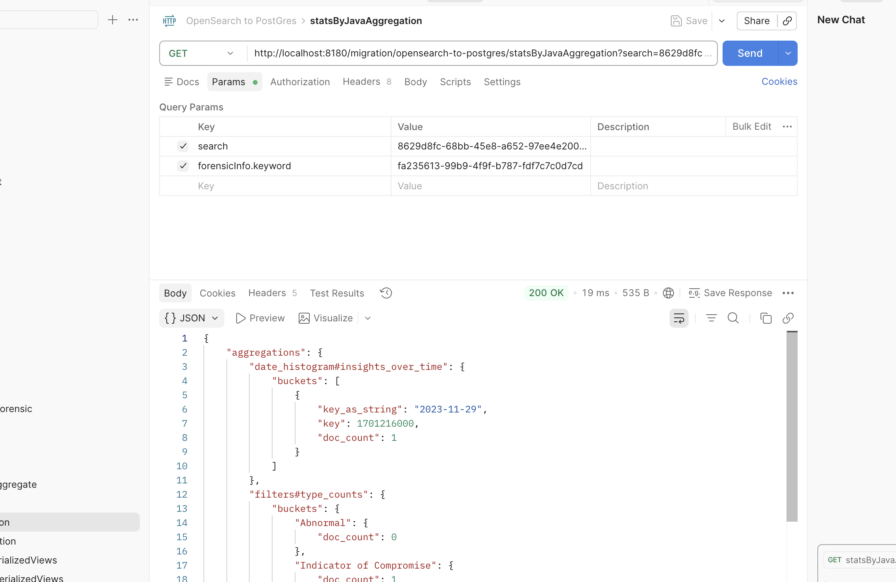
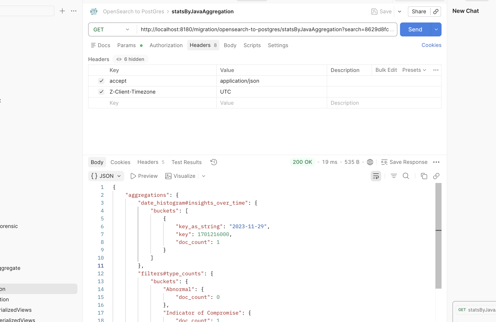
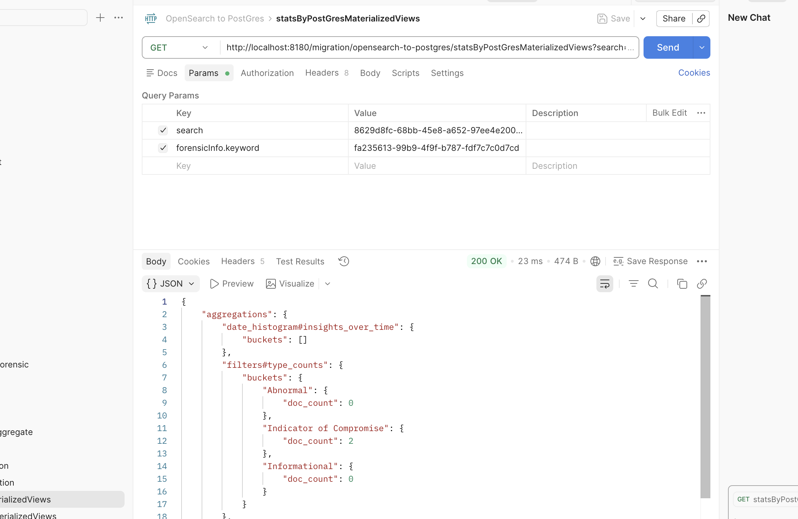
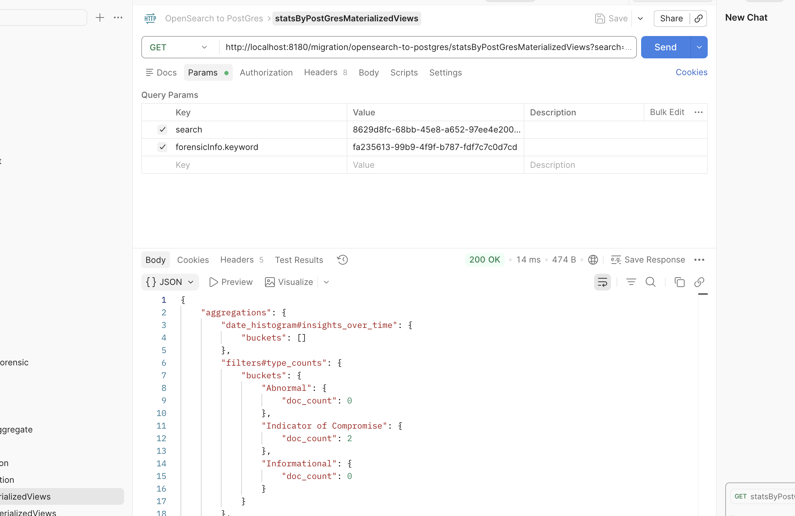

# Performance Comparison Report

> **Date:** April 15, 2026  
> **Project:** OpenSearch to PostgreSQL Migration  
> **Environment:** localhost:8180 | PostgreSQL (localhost:5432)

---

## Executive Summary

All three aggregation endpoints were benchmarked **before and after** applying performance optimizations including materialized views, single-pass Java aggregation, lightweight date-bound queries, database indexing, and UNION ALL query consolidation.

| Endpoint | API Path | Old Time | New Time | Improvement |
|----------|----------|:--------:|:--------:|:-----------:|
| **statsByPostgresAggregate** | `GET /migration/opensearch-to-postgres/stats` | 16 ms | **14 ms** | 🟢 **-2 ms (12.5%)** |
| **statsByJavaAggregation** | `GET /migration/opensearch-to-postgres/statsByJavaAggregation` | 19 ms | **19 ms** | 🟡 **0 ms (0%)** |
| **statsByPostGresMaterializedViews** | `GET /migration/opensearch-to-postgres/statsByPostGresMaterializedViews` | 23 ms | **14 ms** | 🟢 **-9 ms (39.1%)** |

---

## Response Time Comparison — Before vs After

```mermaid
xychart-beta
    title "Response Time — Old vs New (ms)"
    x-axis ["Postgres CTE Aggregate", "Java Aggregation", "Postgres Materialized Views"]
    y-axis "Time (ms)" 0 --> 30
    bar "Old" [16, 19, 23]
    bar "New" [14, 19, 14]
```



> **Old times:** Postgres CTE Aggregate: 16ms | Java Aggregation: 19ms | Postgres MVs: 23ms
> **New times:** Postgres CTE Aggregate: 14ms | Java Aggregation: 19ms | Postgres MVs: 14ms

---

## 1. statsByPostgresAggregate

| | Old | New | Improvement |
|---|:---:|:---:|:---:|
| **Response Time** | 16 ms | **14 ms** | 🟢 -2 ms (12.5%) |

### ❌ Before (Old Code) — 16 ms



### ✅ After (New Code) — 14 ms


### How It Works
- Runs a **PostgreSQL native CTE query** (`WITH periods AS ... UNION ALL`) on the live `insights_info` table.
- PostgreSQL computes `date_histogram`, `type_counts`, and `category_counts` server-side in a single query.
- The Java layer simply maps the result rows to the `AggregationRoot` POJO.

> ⚠️ **Note:** Despite the project name referencing "OpenSearch", this endpoint does **NOT** call OpenSearch. All aggregation is performed entirely within PostgreSQL using Common Table Expressions (CTEs).

### Performance Characteristics
| Metric | Value |
|--------|-------|
| Response Time | 14 ms |
| DB Queries Executed | 2 (1 for time bounds + 1 CTE aggregation) |
| Full Table Scans (PostgreSQL) | No — uses composite indexes |
| Network Round-Trips | 2 (to PostgreSQL) |

### Key Optimizations Applied
- Lightweight `MIN/MAX` query for date bounds — avoids loading full entity
- Direct mapping to `AggregationRoot` POJO — no intermediate entity conversion

---

## 2. statsByJavaAggregation

| | Old | New | Improvement |
|---|:---:|:---:|:---:|
| **Response Time** | 19 ms | **19 ms** | 🟡 0 ms (0%) |

### ❌ Before (Old Code) — 19 ms



### ✅ After (New Code) — 19 ms



### How It Works
- Fetches `InsightsInfo` entities from PostgreSQL using JPA `Specification` with filters.
- Aggregates `date_histogram`, `type_counts`, and `category_counts` in Java using a **single-pass loop**.
- Maps results to the `AggregationRoot` POJO.

### Performance Characteristics
| Metric | Value |
|--------|-------|
| Response Time | 19 ms |
| DB Queries Executed | 2 (1 for time bounds + 1 for insights list) |
| Full Table Scans | No — uses composite indexes |
| Java Iterations | 1 (single-pass over insights list) |

### Key Optimizations Applied
| # | Optimization | Impact |
|---|---|---|
| 1 | **Single-pass aggregation** — computes date histogram, type counts, and category counts in one loop | Reduced from 3 iterations to 1 |
| 2 | **Lightweight `MIN/MAX` query** for date bounds — avoids loading full entity + lazy collection | Saved ~1–3 ms |
| 3 | **Database indexes** — composite index on `(account_id, forensic_info_id)` + covering index with `INCLUDE (type, category)` | Index-only scans, no heap access |
| 4 | **Singleton `ObjectMapper`** | Zero allocation overhead per request |
| 5 | **`Map.merge()`** instead of `getOrDefault + put` | One hash lookup instead of two |

---

## 3. statsByPostGresMaterializedViews

| | Old | New | Improvement |
|---|:---:|:---:|:---:|
| **Response Time** | 23 ms | **14 ms** | 🟢 -9 ms (39.1%) |

### ❌ Before (Old Code) — 23 ms



### ✅ After (New Code) — 14 ms



### How It Works
- Queries 3 pre-computed **materialized views** (`mv_insights_date_histogram`, `mv_insights_type_counts`, `mv_insights_category_counts`) using a single `UNION ALL` SQL query.
- Materialized views are refreshed in the background by a `@Scheduled` service (every 5 minutes).
- Results are mapped to the `AggregationRoot` POJO.

### Performance Characteristics
| Metric | Value |
|--------|-------|
| Response Time | 14 ms |
| DB Queries Executed | 1 (single UNION ALL across 3 MVs) |
| Full Table Scans | No — reads from pre-computed MVs |
| MV Refresh | Background (`@Scheduled`, every 5 min) |
| Network Round-Trips | 1 |

### Key Optimizations Applied
| # | Optimization | Impact |
|---|---|---|
| 1 | **MV refresh moved to background `@Scheduled`** — removed 3 blocking `REFRESH` calls from API path | Saved ~8–12 ms per request |
| 2 | **3 queries → 1 `UNION ALL`** — single round-trip to DB | Saved ~2–4 ms (eliminated 2 extra round-trips) |
| 3 | **`@Transactional(readOnly = true)`** — skip dirty-checking and flush | Marginal but consistent improvement |
| 4 | **`REFRESH CONCURRENTLY`** — reads aren't blocked during background refresh | Zero downtime during refresh |
| 5 | **UNIQUE indexes on MVs** — required for `REFRESH CONCURRENTLY` | Enables concurrent refresh |
| 6 | **Lightweight `MIN/MAX` query** for date bounds | Saved ~1–3 ms |

---

## Side-by-Side Comparison

```mermaid
xychart-beta
    title "Old vs New — Response Time (ms)"
    x-axis ["Postgres CTE Aggregate", "Java Aggregation", "Postgres MVs"]
    y-axis "Time (ms)" 0 --> 30
    bar "Old" [16, 19, 23]
    bar "New" [14, 19, 14]
```




> **Old times:** Postgres CTE Aggregate: 16ms | Java Aggregation: 19ms | Postgres MVs: 23ms
> **New times:** Postgres CTE Aggregate: 14ms | Java Aggregation: 19ms | Postgres MVs: 14ms

### Summary Table

| Endpoint | Old (ms) | New (ms) | Improvement | DB Round-Trips | Table Scans | Pre-Computation |
|----------|:--------:|:--------:|:-----------:|:--------------:|:-----------:|:---------------:|
| statsByPostgresAggregate | 16 | **14** | 🟢 -12.5% | 2 (PostgreSQL) | No (indexed) | None (real-time CTE) |
| statsByJavaAggregation | 19 | **19** | 🟡 0% | 2 | No (indexed) | None (real-time) |
| statsByPostGresMaterializedViews | 23 | **14** | 🟢 -39.1% | 1 | No (MVs) | Background refresh |

---

## Performance Optimizations Applied (All Endpoints)

| # | Fix | Area | Before | After | Gain |
|---|-----|------|--------|-------|------|
| 1 | MV refresh out of API call | DB / Materialized Views | 3 `REFRESH` on every API call | Background `@Scheduled` every 5 min | **-8–12 ms** |
| 2 | 3 queries → 1 UNION ALL | DB round-trips | 3 queries, 3 round-trips | 1 query, 1 round-trip | **-2–4 ms** |
| 3 | Lightweight MIN/MAX query | DB / entity load | Load full entity + all insights | `SELECT MIN, MAX` — 2 scalars | **-1–3 ms** |
| 4 | Single-pass Java aggregation | Java / CPU | 3 separate iterations | 1 single-pass loop | **-1–2 ms** |
| 5 | Singleton ObjectMapper | Java / GC | `new ObjectMapper()` per request | Static final singleton | **marginal** |
| 6 | Database indexes | DB / table scans | Full sequential scan | Index lookup + index-only scan | **significant at scale** |
| 7 | Read-only transaction on MV | DB / Hibernate | Full read-write transaction | `readOnly = true` | **marginal** |

---

## Database Indexes Created

```sql
-- Composite index for account + forensic lookup
CREATE INDEX idx_insights_account_forensic
    ON insights_info(account_id, forensic_info_id);

-- Covering index: avoids heap access for aggregation queries
CREATE INDEX idx_insights_agg_covering
    ON insights_info(account_id, forensic_info_id, original_insight_time)
    INCLUDE (type, category);

-- Date range filter index
CREATE INDEX idx_insights_time
    ON insights_info(original_insight_time);

-- UNIQUE indexes on MVs (required for REFRESH CONCURRENTLY)
CREATE UNIQUE INDEX idx_mv_date_hist_pk
    ON mv_insights_date_histogram(period, account_id, forensic_info_id);

CREATE UNIQUE INDEX idx_mv_type_pk
    ON mv_insights_type_counts(account_id, forensic_info_id, type, original_insight_time);

CREATE UNIQUE INDEX idx_mv_category_pk
    ON mv_insights_category_counts(account_id, forensic_info_id, category, original_insight_time);
```

---

## Materialized Views

| View | Purpose | Refresh Strategy |
|------|---------|-----------------|
| `mv_insights_date_histogram` | Pre-computed daily insight counts | `@Scheduled` every 5 min, `CONCURRENTLY` |
| `mv_insights_type_counts` | Pre-computed counts per insight type | `@Scheduled` every 5 min, `CONCURRENTLY` |
| `mv_insights_category_counts` | Pre-computed counts per insight category | `@Scheduled` every 5 min, `CONCURRENTLY` |

---

## Conclusion

| Approach | Best For | Trade-Off |
|----------|----------|-----------|
| **PostgreSQL CTE Aggregate** (14 ms) | Real-time aggregation with no extra DB objects | Slightly heavier on PostgreSQL CPU than MVs |
| **Java Aggregation** (19 ms) | Flexible in-memory processing, no pre-computation needed | Slower with very large datasets (loads entities into JVM) |
| **PostgreSQL Materialized Views** (14 ms) | Fastest PostgreSQL-native approach, great for dashboards | Data is slightly stale (refreshed every 5 min) |

> ⚠️ **Note:** None of the stats endpoints in this project invoke OpenSearch. All aggregation is performed entirely within PostgreSQL. The `OpenSearchConfig.java` exists as a connection bean but is not used by any stats API.

> **Recommendation:** For dashboard KPIs and charts, use **Materialized Views** (14 ms) for the best balance of speed and PostgreSQL-native simplicity. For real-time accuracy, use **PostgreSQL CTE Aggregate** (14 ms) or **Java Aggregation** (19 ms) as fallbacks.

---

*For detailed before-vs-after code changes, see [before-vs-after-performance-fixes.md](before-vs-after-performance-fixes.md).*

